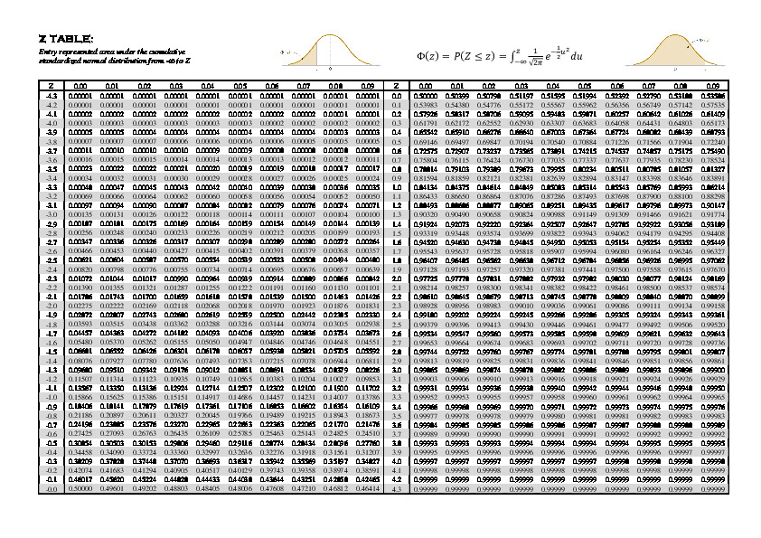

# Why?

Because you dislike spending time hunting down numbers on some difficult
to read table, and using online calculators disrupts your focus. With
`dist`, you can compute the PDFs and CDFs you need from the comfort of
your command line.



Here's a fun game: find `z` such that `P(Z < z) = 0.03074` using the
table in figure 1. Was that fun? Of course it wasn't; It was horrible!
Now try running `dist -zi .03074` instead. So much more comfortable,
isn't it?

# Supported distributions

-    Binomial distribution
-    Exponential distribution
-    F-distribution
-    Geoemetric distribution
-    Poisson distribution
-    Student-t distribution
-    Weibull distribution
-    Hypergeoemtric distribution
-    Guassian (Normal) distribution

You can compute either the `P` or `Q` cumulative functions, and even
their inverses (if the distribution is continuous) via the  `-l`, `-h` and the `-i` options
respectively. See `dist -h` for more.

# Installing

`dist` depends on [gsl](https://www.gnu.org/software/gsl/).

```
$ git clone https://github.com/msaher/dist
$ make
```

Move the `dist` binary to wherever you feel comfortable.

# Usage

Take a look at `dist -h`.
